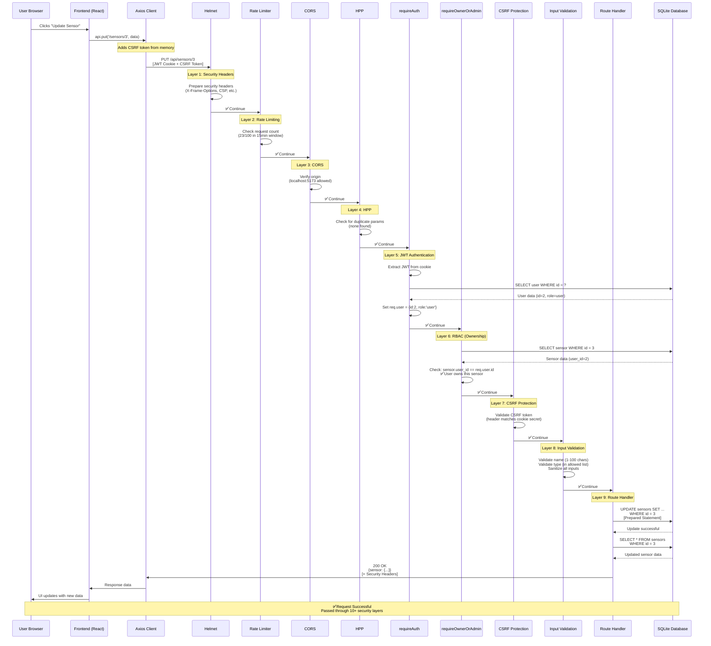
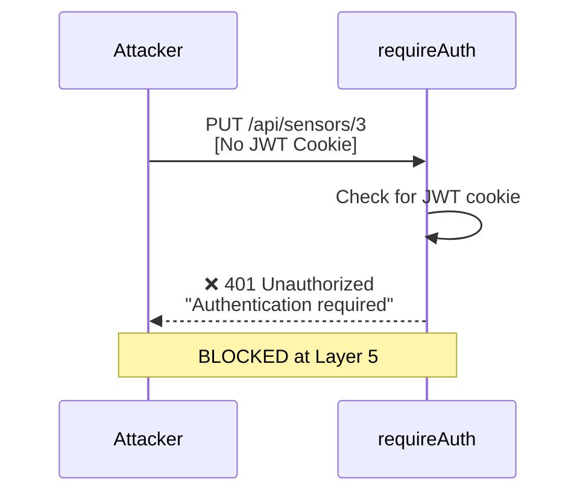
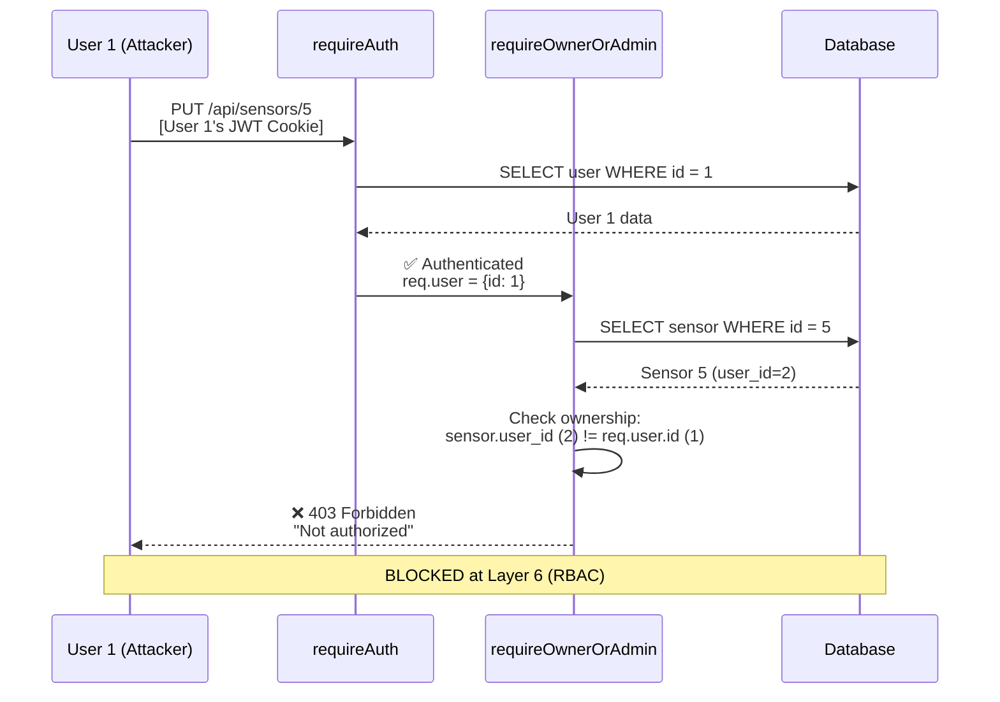
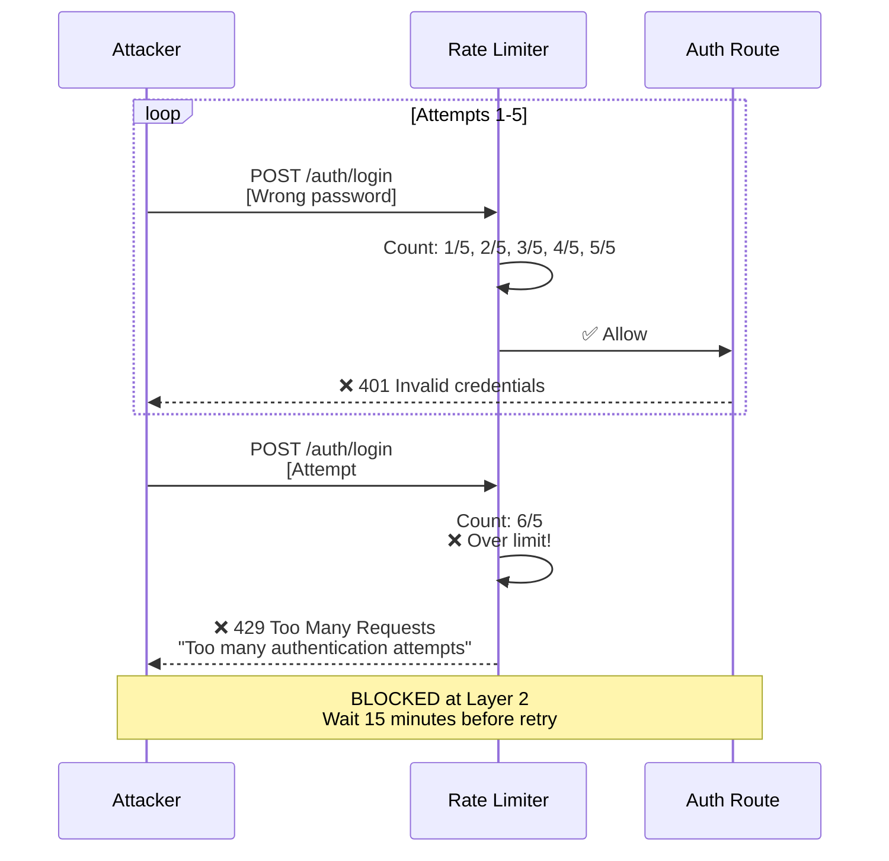

# Security Architecture Sequence Diagram

## Complete Request Flow: User Updates Sensor



---

## Attack Scenarios (Request Blocked)

### Scenario 1: Missing Authentication


---

### Scenario 2: Unauthorized Access (Wrong Owner)


---

### Scenario 3: CSRF Attack

```mermaid
sequenceDiagram
    participant E as Evil Site
    participant U as Victim's Browser
    participant Auth as requireAuth
    participant RBAC as requireOwnerOrAdmin
    participant CSRF as CSRF Protection

    E->>U: <form action="app.com/api/sensors/3"><br/>Submit hidden form
    U->>Auth: PUT /api/sensors/3<br/>[Victim's JWT Cookie]<br/>[❌ No CSRF Token]
    Auth->>Auth: ✅ JWT valid
    Auth->>RBAC: ✅ Continue
    RBAC->>RBAC: ✅ Owner verified
    RBAC->>CSRF: Continue
    CSRF->>CSRF: Check CSRF token<br/>❌ Token missing or invalid
    CSRF-->>U: ❌ 403 Forbidden<br/>"EBADCSRFTOKEN"
    U->>E: Attack failed

    Note over E,CSRF: BLOCKED at Layer 7 (CSRF)
```


---

### Scenario 4: SQL Injection Attempt
```mermaid
sequenceDiagram
    participant U as Attacker
    participant Auth as requireAuth
    participant RBAC as requireOwnerOrAdmin
    participant CSRF as CSRF Protection
    participant Val as Input Validation
    participant Hand as Route Handler
    participant DB as Database

    U->>Auth: PUT /api/sensors/3<br/>{name: "Test'; DROP TABLE sensors; --"}
    Auth->>RBAC: ✅ Authenticated
    RBAC->>CSRF: ✅ Authorized
    CSRF->>Val: ✅ CSRF valid

    Note over Val: Input Validation & Sanitization
    Val->>Val: Sanitize input:<br/>Escape special characters<br/>Validate length
    Val->>Hand: ✅ Sanitized input

    Note over Hand: Prepared Statement (Final Defense)
    Hand->>DB: UPDATE sensors<br/>SET name = ?<br/>WHERE id = ?<br/>Params: ["Test'; DROP...", 3]
    DB->>DB: Treat entire string as literal<br/>No SQL execution
    DB-->>Hand: Update successful
    Hand-->>U: 200 OK<br/>name: "Test'; DROP TABLE sensors; --"

    Note over U,DB: ✅ Attack PREVENTED<br/>String stored as literal text
```

---

### Scenario 5: Brute Force Attack


---

## Zero-Trust Architecture Summary

```
┌─────────────────────────────────────────────────────────────┐
│                    FRONTEND (React + Axios)                   │
│  • CSRF token management                                      │
│  • Automatic token refresh                                    │
│  • Credentials included in requests                           │
└─────────────────────┬───────────────────────────────────────┘
                      │
                      │ HTTP Request
                      │ [JWT Cookie + CSRF Token + Data]
                      ▼
┌─────────────────────────────────────────────────────────────┐
│                      SECURITY LAYERS                          │
├─────────────────────────────────────────────────────────────┤
│ Layer 1: Helmet        │ XSS, Clickjacking Protection        │
│ Layer 2: Rate Limiter  │ Brute Force Prevention              │
│ Layer 3: CORS          │ Origin Validation                   │
│ Layer 4: HPP           │ Parameter Pollution Prevention      │
│ Layer 5: requireAuth   │ JWT Verification + User Lookup      │
│ Layer 6: RBAC          │ Ownership/Role Authorization        │
│ Layer 7: CSRF          │ Cross-Site Request Forgery Defense  │
│ Layer 8: Validation    │ Input Sanitization & Format Check   │
│ Layer 9: Handler       │ Business Logic                      │
│ Layer 10: DB           │ Prepared Statements (SQL Injection) │
└─────────────────────┬───────────────────────────────────────┘
                      │
                      │ Response
                      │ [Data + Security Headers]
                      ▼
┌─────────────────────────────────────────────────────────────┐
│                      FRONTEND RECEIVES                        │
│  • Data for UI update                                         │
│  • Error handling (401/403/400/429)                           │
│  • CSRF token refresh on expiration                           │
└─────────────────────────────────────────────────────────────┘
```

---

## Security Decision Tree

```
                    ┌──────────────┐
                    │  Request     │
                    │  Arrives     │
                    └──────┬───────┘
                           │
                    ┌──────▼───────┐
                    │ Rate Limit   │
                    │ Exceeded?    │
                    └──┬───────┬───┘
                  YES  │       │ NO
            ┌──────────┘       └──────────┐
            │                              │
        ┌───▼────┐                    ┌───▼────┐
        │ 429    │                    │  JWT   │
        │ Error  │                    │ Valid? │
        └────────┘                    └───┬────┘
                                          │
                                    ┌─────┴─────┐
                                 NO │           │ YES
                          ┌─────────┘           └─────────┐
                          │                               │
                      ┌───▼────┐                     ┌────▼────┐
                      │ 401    │                     │  User   │
                      │ Error  │                     │  Owns   │
                      └────────┘                     │Resource?│
                                                     └────┬────┘
                                                          │
                                                    ┌─────┴─────┐
                                                 NO │           │ YES
                                          ┌─────────┘           └─────────┐
                                          │                               │
                                      ┌───▼────┐                     ┌────▼────┐
                                      │ 403    │                     │  CSRF   │
                                      │ Error  │                     │  Valid? │
                                      └────────┘                     └────┬────┘
                                                                          │
                                                                    ┌─────┴─────┐
                                                                 NO │           │ YES
                                                          ┌─────────┘           └─────────┐
                                                          │                               │
                                                      ┌───▼────┐                     ┌────▼────┐
                                                      │ 403    │                     │  Input  │
                                                      │ Error  │                     │  Valid? │
                                                      └────────┘                     └────┬────┘
                                                                                          │
                                                                                    ┌─────┴─────┐
                                                                                 NO │           │ YES
                                                                          ┌─────────┘           └─────────┐
                                                                          │                               │
                                                                      ┌───▼────┐                     ┌────▼────┐
                                                                      │ 400    │                     │ Process │
                                                                      │ Error  │                     │ Request │
                                                                      └────────┘                     └────┬────┘
                                                                                                          │
                                                                                                          │
                                                                                                     ┌────▼────┐
                                                                                                     │   200   │
                                                                                                     │ Success │
                                                                                                     └─────────┘
```

---

## Current Architecture vs Zero-Trust

### OLD (Vulnerable) Architecture:
```
Request → Router → Basic Auth → Handler → Database
    ↓
Single point of failure
No defense-in-depth
```

### NEW (Zero-Trust) Architecture:
```
Request → Multiple Security Layers → Handler → Database
    ↓
Defense-in-depth
Never trust, always verify
Principle of least privilege
Explicit authorization at every level
```

---

## Key Principles Demonstrated

1. **Never Trust, Always Verify**
   - Every request authenticated (JWT)
   - Every resource access authorized (RBAC)
   - Every state change protected (CSRF)

2. **Defense in Depth**
   - 10+ independent security layers
   - If one fails, others still protect
   - Multiple validation points

3. **Principle of Least Privilege**
   - Users only access their own resources
   - Admins explicitly granted elevated permissions
   - No default access

4. **Explicit Security**
   - No implicit trust
   - All permissions checked explicitly
   - All inputs validated explicitly

5. **Fail Secure**
   - Default action is deny
   - Errors stop processing
   - No fallback to insecure paths
